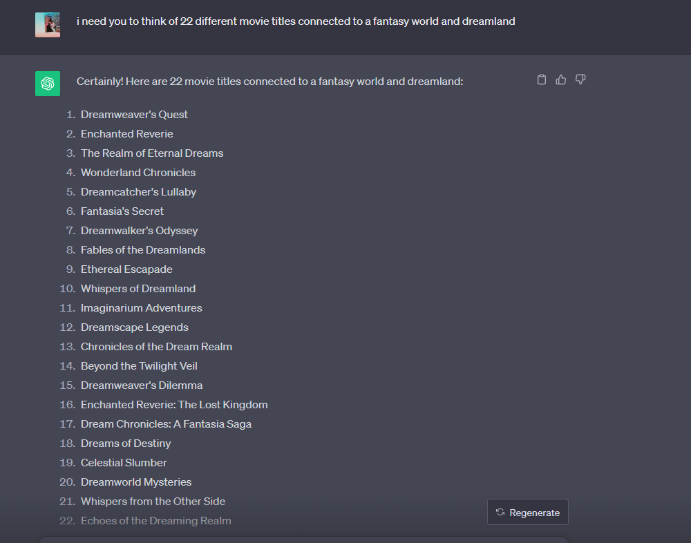

## Angular Practice
> *This project was generated with [Angular CLI](https://github.com/angular/angular-cli) version 16.2.6.*
> 
>> **Development server**
>> 
>>> Run ```ng serve``` for a dev server.
>>
>>> Navigate to `http://localhost:4200/`.
>> 
>>> The application will automatically reload if you change any of the source files.
>
>> **Code scaffolding**
>>  
>>> Run `ng generate component component-name` to generate a new component.
>> 
>> You can also use `ng generate directive|pipe|service|class|guard|interface|enum|module`.
>
>> **Build**
>> 
>>> Run `ng build` to build the project.
>>
>>> The build artifacts will be stored in the `dist/` directory.
>
>> **Running unit tests**
>> 
>>> Run `ng test` to execute the unit tests via [Karma](https://karma-runner.github.io).
> 
>> **Running end-to-end tests**
>> 
>>> Run `ng e2e` to execute the end-to-end tests via a platform of your choice.
>> 
>>> To use this command, you need to first add a package that implements end-to-end testing capabilities.
> 
>> **Further help**
>> 
>>> *To get more help on the Angular CLI use `ng help` or go check out the [Angular CLI Overview and Command Reference](https://angular.io/cli) page.*
>> ---
>> ### Angular Concept Implementation Beginner Project on YouTube & Reference Cheat Sheet For Personal Use
> ***Please don't mind my naming choice for variables and examples. It is all with humorous intent and for the sake of my own entertainment while documenting the stuff. ~ xD***
>> **CLI Install**
>>> ```
>>> npm install -g @angular/cli
>>> ```
>> **New Project**
>>> ```
>>> ng new
>>> ```
>> **Serve Full**
>>> ```
>>> ng new my-first-project
>>> cd my-first-project
>>>  ng serve
>>>  ```
>> **Bootstrap** 
>>> ```
>>> npm install bootstrap
>>> ```
>>>> go angular.json -> add to "styles" ``` "node_modules/bootstrap/dist/css/bootstrap.min.css" ```
>>>>> You need to install different components for all pre-planned features 
>>> ```
>>>  ng generate component baba-ti
>>>  ```
>>>> another example with the shortened version of this command and a ready component for login and home is:
>>> ``` ng g c home ``` , ```ng g c login``` 
>> **App Routing**
> ./app/app-routing.module.ts
> import the component in the top and add directory
>>>> ```
>>>>  import { BabaTiComponent } from './babati/babati.component';
>>>> ```
> then in the const routes: Routes = [ Array ]  in the array write the pathings like:
>> ```
>> { path: 'babati', component: BabaTiComponent }, {..}
>> ```
---
### Login
> ``` { path: '', redirectTo: 'login', pathMatch: 'full' }, ``` if you wanna redirect to login (if u have a login to redirect to it), its part of the logic 
>> also this ``` { path: '**', component: LoginComponent } ``` because the indian guy in the tutorial said so but didnt really explain why 
>>> ! HE ALSO SAID IT HAS TO BE THE **LAST** ROW ALWAYS
>>>> you also need to add ```<router-outlet></router-outlet>``` to the ``app.component.html``
>>>>> components act as separate pages to your localhost:6969/babati for example 
>>>>>> styled the login.component.html + login.component.scss
>>>> 
>>>>> functionality of the login form begins with 'data binding' concept, which needs more looking into separate from this tutorial ``[(ngModel)]="``
>>>>>> it's syntax is inserted directly into the tag: <input type="text" name="uname" class="form-control" [(ngModel)]="username"/>
>>>>>>> then you further import it into the `imports: []` array as FormsModule & include it on the top if your IDE doesn't automatically 
>>>>>>> 
>>>>>>>> Login returns errors for empty fields and wrong inputs. Right credentials are username: babati, password: pizza
---
>> Tried to setup Docker on the [docker-fail](https://github.com/Hiratsuna/Angular-Practice-Beginner-Concepts/tree/docker-fail) branch, but ran into some incompatibility issues with my system and the Docker Toolbox, so I decided to scrap that away for now and may pick it up later, cause it might end up costing me more time than I am prepared to give for it *AT THIS STAGE*
>>> Did some brainstorming with Chat GPT regarding alternative software I can use to setup the containers without downloading Docker Desktop, cause I want to avoid that at all costs, so if you are curious about that it's [Here](https://chat.openai.com/share/429629ac-77de-4f56-8a4a-ede6d77f3925). Can't guarantee if it's totally relevant, though. Just fyi. 
>>
> Also tried to deploy the Angular app itself following [this](https://www.focisolutions.com/2020/04/github-actions-deploying-an-angular-app/) tutorial and another one that deployed it with the cli creating a /dist directory, but after a few hours of breaking things and trying to make it work - the [site](https://hiratsuna.github.io/Angular-Practice-Beginner-Concepts/) got deployed from the ReadMe.md file on the gh-pages branch, which is a bit behind on `main` at this point.
>> 
>>> moving on with the application components =D 
>> 
> 
>> '*ngFor'
>>> Property Binding 
>> 
> Needs documenting:
- HttpModule;
- Home;
- Header attachment for the component
- Bootstrap
>
>> Had some fun with midjourney to generate whole new movie thumbnails and made chatgpt name them 
>>> ```ng g m >name<``` to generate a new module
>>>> ```ng g m 'module name'/'component name'```  - when generating a component for a module u use module/component-name syntax for the command
>>> [For the Rating](https://ng-bootstrap.github.io/#/components/rating/examples)
>>>>
>>>> **Update: 31/10/2023 -- Soo I have added documentation inside the code with SenpAI, as I made him comment notes inside. Will probably document them here in the README somehow when it's finished. o/
